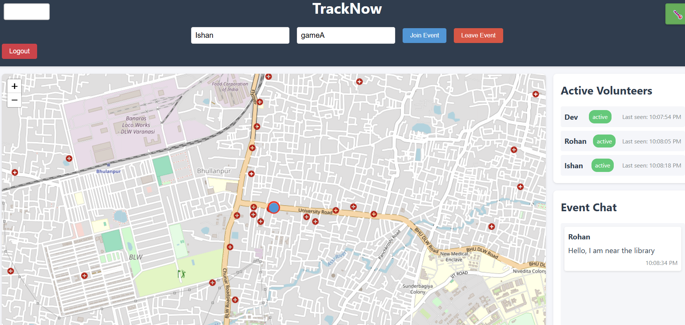
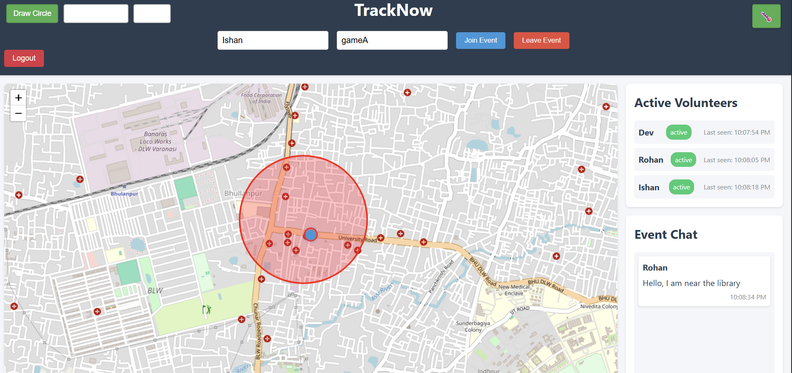
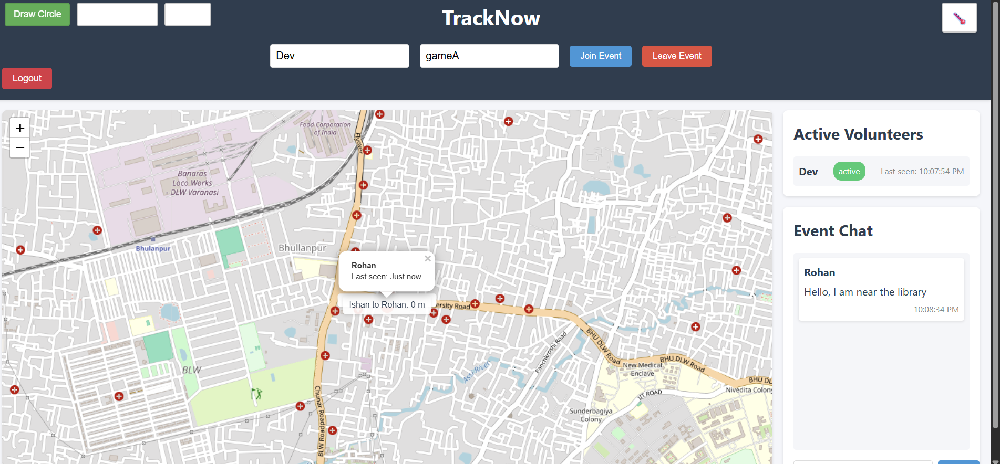
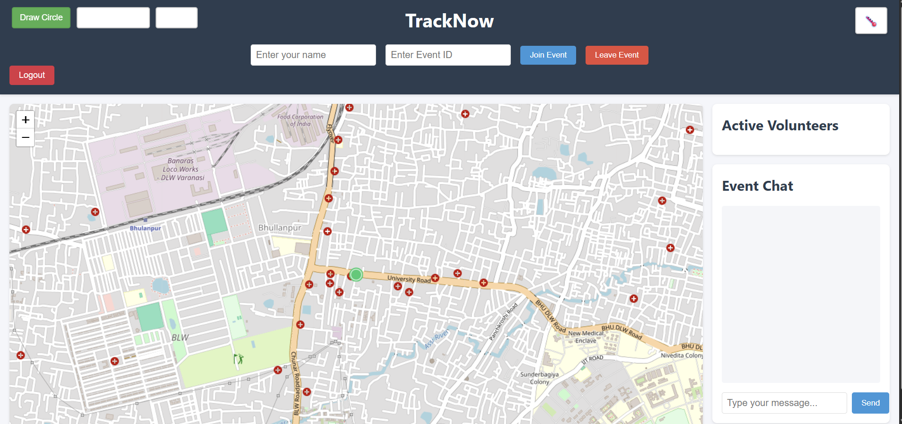

# TrackNow - Real-Time Volunteer Tracking System

TrackNow is a comprehensive real-time tracking and management system designed for coordinating volunteers during events and emergency situations. The system provides real-time location tracking, geofencing, chat functionality, and distance measurements between volunteers.

## Features

### Real-Time Location Tracking

- Live tracking of volunteer locations on an interactive map
- Custom markers with volunteer names and status
- Advanced heatmap visualization showing volunteer density patterns
  - Red/Yellow = High concentration of volunteers
  - Blue/Green = Low concentration
  - Dynamic updates based on real-time movement
- Automatic location updates with high accuracy
- Historical location data tracking

### Geofencing System

- Create circular geofences on the map
- Set up inclusion/exclusion zones
- Real-time alerts when volunteers enter/exit geofences
- Customizable alert messages and actions
- Integration with Kafka for event streaming
- Rule-based geofence triggers

### Communication Tools

- Real-time chat system for event coordination
- System notifications for important events
- Visual alerts for geofence breaches
- Status updates for all volunteers
- Redis-based message queuing for reliable delivery
- Offline message handling

### Distance Measurement

- Measure distances between selected volunteers
- Visual distance lines on the map
- Real-time distance updates
- Multiple volunteer selection for group measurements
- Historical distance tracking
- Area coverage analysis

### User Interface

- Clean and intuitive map interface
- Easy-to-use controls for all features
- Responsive design for various screen sizes
- Custom markers and visual indicators
- Dark/Light mode support
- Mobile-friendly interface

## Technical Stack

### Frontend

- HTML5, CSS3, JavaScript
- Leaflet.js with OpenStreetMap
- Socket.IO for real-time updates
- Custom heatmap visualization
- Responsive design framework

### Backend

- Node.js with Express.js
- Socket.IO for real-time communication
- MongoDB with PostGIS for geospatial queries
- Redis for pub/sub messaging and caching
- Apache Kafka for event streaming
- JWT for authentication

### Data Processing

- Kafka Streams for real-time data processing
- Redis for caching and session management
- MongoDB for persistent storage
- PostGIS for advanced spatial queries
- Real-time analytics processing

## Usage

### Getting Started

1. **Login/Register**: Create an account or login to access the system
2. **Join Event**: Enter your name and event ID to join a tracking session
3. **Track Volunteers**: View real-time locations of all volunteers on the map
4. **Create Geofences**: Use the drawing tools to create geofences
5. **Measure Distances**: Click on volunteers to measure distances between them
6. **Chat**: Use the chat system to communicate with other volunteers
7. **View Heatmap**: Toggle heatmap visualization to see volunteer density
8. **Monitor Alerts**: Receive real-time notifications for geofence breaches

## Advanced Features

### Kafka Integration

- Real-time event streaming
- Geofence breach notifications
- Location update processing
- Chat message delivery
- System event logging

### Redis Features

- Session management
- Real-time message queuing
- Caching of frequently accessed data
- Pub/sub messaging for notifications
- Rate limiting implementation

### Heatmap Analytics

- Real-time density visualization
- Historical pattern analysis
- Custom color gradients
- Dynamic radius adjustment
- Performance optimization

## Security Features

- JWT-based authentication
- Secure WebSocket connections
- Input validation and sanitization
- Rate limiting for API endpoints
- Secure password hashing
- Redis-based session management
- Kafka message encryption

